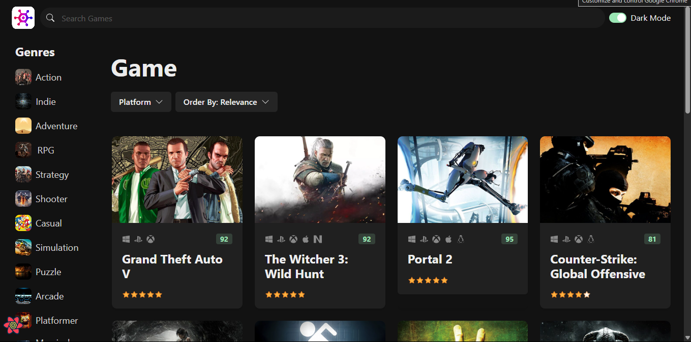
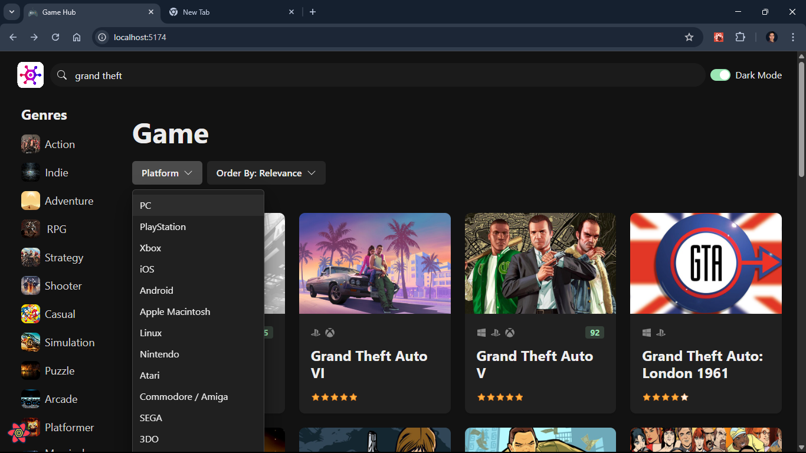
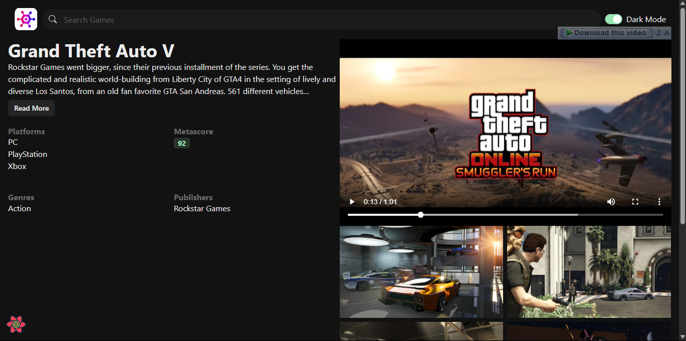
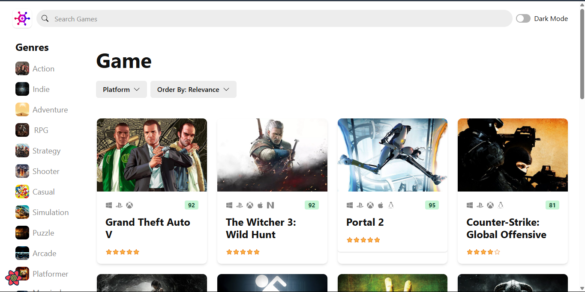

# 🎮 Game Hub

A responsive and interactive video game discovery platform built with React 18 and TypeScript. Users can explore, search, and filter games by genre and platform — all powered by modern UI and state management libraries.



## 🚀 Live Demo

👉 [View Live](https://game-hub-psi-khaki.vercel.app/)

---

## ✨ Features

- 🔍 **Search & Filter**: Find games by genre, platform, or title.
- ⚡ **Optimized Performance**: Smooth experience with lazy loading and efficient data fetching.
- 💡 **Responsive Design**: Mobile-first layout with Chakra UI components.
- 🧭 **State Management**: Global state handled via Zustand.
- 🔄 **Data Fetching**: React Query + Axios for clean async logic.
- 🎞️ **UI Animations**: Subtle and beautiful transitions using Framer Motion.
- 🌙 **Dark Mode Ready** Toggle light/dark mode as you prefer.

---

## 🛠️ Tech Stack

| Tool          | Role                           |
| ------------- | ------------------------------ |
| React 18      | UI Library                     |
| TypeScript    | Static Typing                  |
| Chakra UI     | Component Library & Styling    |
| React Query   | Server State Management        |
| Axios         | API Requests                   |
| Zustand       | Local/Global State Management  |
| Framer Motion | UI Animations                  |
| Vite          | (Optional) Fast dev build tool |

---

## 📚 Project Background

This project is the final result of [Mosh Hamedani’s React 18 Mastery Course](https://codewithmosh.com/p/mastering-react), where I deeply learned component architecture, clean code practices, hooks, and modern React patterns. This app changed how I think about building React projects.

It was a fun and rewarding experience! 😄🎉

---

## 📦 Installation

```bash
# Clone the repository
git clone https://github.com/mostafa-meerzad/game-hub.git

# Navigate into the project folder
cd game-hub

# Install dependencies
npm install

# Run the development server
npm run dev
```

---

## 🗃 API & Data

Game data is fetched from the [RAWG Video Games Database API](https://rawg.io/apidocs), offering a rich source of game titles, genres, screenshots, and more.

---

## 📸 Screenshots

<!-- You can include some images like these -->






---

## 🧑‍💻 Author

**Mostafa Meerzad**
📍 Kabul, Afghanistan
🔗 [LinkedIn](https://www.linkedin.com/in/mostafa-meerzad-a753371b7/)
🎓 Self-taught Software Developer

---

## 📝 License

This project is open-source and available under the [MIT License](LICENSE).

---

> Built with ❤️ as a joyful coding journey and milestone after completing Mosh Hamedani’s React course.
